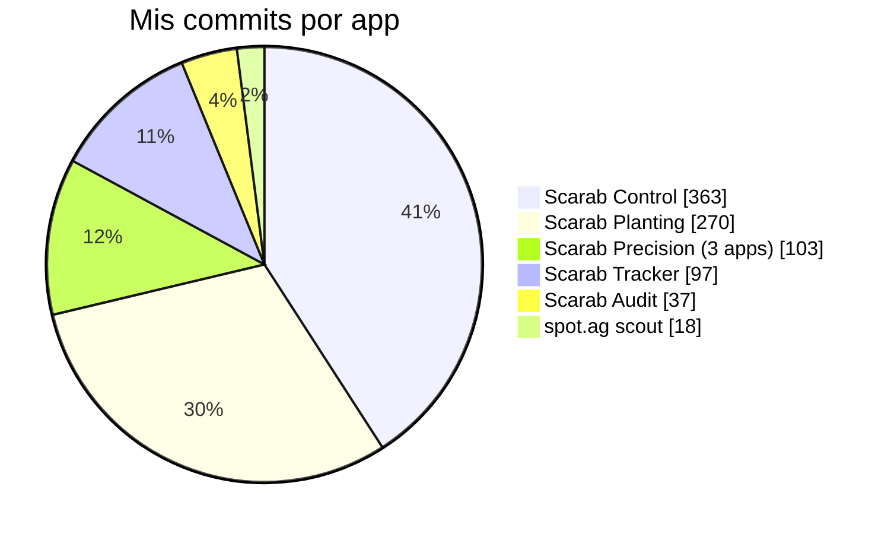
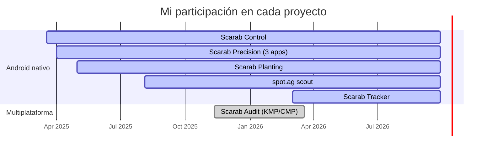

<!-- Encabezado -->

  

  

  
  
  
  

---

## 👨‍💻 Sobre mí

Soy **desarrollador de aplicaciones móviles en [Scarab Solutions](https://github.com/Scarab-Solutions-LTD)**, empresa de tecnología para la **agricultura de precisión**. Construyo y mantengo el ecosistema de apps que usan a diario los equipos de campo: monitores, agrónomos, técnicos y supervisores que trabajan en fincas e invernaderos, muchas veces **sin conexión a internet**.

Mi trabajo va desde crear apps nuevas con **Kotlin Multiplatform y Compose Multiplatform** hasta modernizar bases de código con años en producción. Por ejemplo, migré a Kotlin y Clean Architecture apps que venían de Java.

- 🌱 **Offline-first de verdad:** Room y SQLDelight como fuente de verdad local, con sincronización en segundo plano, reintentos y recuperación automática.
- 📡 **Hardware en campo:** sensores Bluetooth LE, actualización de firmware por el aire (DFU), GPS con control de precisión y cámara con ML Kit.
- 🏗️ **Arquitectura limpia:** MVVM y Clean Architecture, casos de uso, inyección de dependencias con Hilt y Koin, y código testeable.
- 🔭 **Calidad y observabilidad:** tests unitarios y BDD, CI con GitHub Actions y SonarQube, y monitoreo con Crashlytics, Sentry y LogRocket.

---

## 🚜 Apps que desarrollo en Scarab Solutions

### 🟢 Scarab Control
> **Controles e inspecciones de campo con formularios dinámicos.**

App Android con la que los operarios capturan controles de calidad y de labores siguiendo la jerarquía agrícola **finca → casa → bloque → cultivo → variedad → producto**. Los formularios los define el servidor y la app los genera en tiempo de ejecución. Cada captura queda **georreferenciada** y se sincroniza cuando vuelve la conexión.

- Vinculación del dispositivo por **QR** con un escáner híbrido (Google Code Scanner, con respaldo en CameraX + ML Kit).
- **Login offline** con verificación local segura y **renovación automática de tokens**.
- **Motor de formularios** con campos de texto, número, fecha, rango, booleano y selección, más dependencias jerárquicas.
- **Sincronización** manual y en segundo plano con WorkManager, errores claros en cada fase y recuperación automática del acceso a las fincas.
- Recordatorios diarios programables, notificaciones y **actualizaciones dentro de la app**.
- **CI con GitHub Actions**: tests unitarios, cobertura con JaCoCo y análisis en SonarQube en cada PR.

`Kotlin` `Jetpack Compose` `Material 3` `Hilt` `Room` `WorkManager` `Retrofit` `CameraX` `ML Kit` `Fused Location` `Firebase` `LogRocket` `JUnit 5` `Turbine` `SonarQube`

---

### 🟢 Scarab Precision · Scarab Crop Husbandry · Scarab White Rust
> **Tres apps publicadas desde un solo código base.**

Apps de **monitoreo (scouting) de cultivos en invernadero**. El monitor recorre la finca, la casa y la cama, y registra observaciones de **presencia, conteo y puntuación** según plantillas, en paradas **georreferenciadas**. Las tres apps comparten el código y se generan con **product flavors**: cada una tiene su propia identidad visual y su firma de publicación, y la app comprueba en el alta que el cliente pertenezca a ese producto.

- **GPS pensado para el campo:** descarta posiciones antiguas o simuladas, exige una precisión mínima, cuenta los satélites y sugiere la cama más cercana (Haversine).
- **Offline-first** con Room, migraciones versionadas y **tests de migración**.
- Alta por **QR**, órdenes de trabajo, resumen por cama y casa, y reenvío de datos por fecha.
- Exportación de diagnóstico en **ZIP cifrado con AES-256**.
- Firma de release por app, preparada para CI y válida en Windows, Linux y macOS.

`Kotlin` `Product Flavors` `Room` `Coroutines` `OkHttp` `LocationManager / GNSS` `ZXing` `Sentry` `zip4j`

---

### 🟢 Scarab Planting
> **Registro de siembra, cosecha y erradicación en finca.**

App de campo de la suite de precisión, con la que el personal registra las **labores de siembra, cosecha y erradicación** por finca, invernadero, sector, variedad y trabajador. Guarda cada operación como una acción pendiente y la procesa con una **cadena de sincronización en WorkManager** que sube, notifica y descarga, con restricciones de red y reintentos.

- Emparejamiento por **QR** con escáner híbrido y **login offline**.
- **Calculadora de tallos** por malla, sobrantes y totales, con borrador persistente.
- **Sincronización bidireccional** de datos maestros, con análisis de la causa raíz de cada fallo y re-emparejamiento silencioso.
- **Modo QA** oculto con exportación cifrada de evidencias.
- **Observabilidad avanzada:** detección de bloqueos del hilo principal, análisis de ANR y grabación de sesiones con LogRocket.
- Tests unitarios de los workers y **tests BDD con Cucumber** sobre Android.

`Kotlin` `Jetpack Compose` `Hilt` `Room` `DataStore` `WorkManager` `Retrofit` `kotlinx.serialization` `Arrow` `CameraX` `ML Kit` `Firebase` `LogRocket` `MockK` `Cucumber`

---

### 🟢 Scarab Audit
> **Auditoría de campo multiplataforma con Kotlin Multiplatform.**

App **KMP + Compose Multiplatform** con **un solo código para Android, iOS, escritorio y web (Wasm)**. El auditor elige una finca y unas fechas, y la app genera un **tablero de auditoría** organizado por monitor, bloque y cama. Sobre él valida o corrige las mediciones **píxel a píxel**, con marcas, comentarios, dibujo a mano alzada y fotos.

- **Tablero dibujado con Canvas** y gestos precisos, que convierten las coordenadas de pantalla a píxeles del dato.
- **Comentarios a mano alzada** que se exportan como imagen, y fotos por celda.
- **UI adaptativa:** panel en árbol en tablet y escritorio, y selectores en el móvil.
- Remoto primero, con **caché local en SQLDelight** y un driver distinto por plataforma.
- Código específico de cada plataforma con `expect/actual`: cámara, orientación y módulos de DI.

`Kotlin Multiplatform` `Compose Multiplatform` `Android` `iOS` `Desktop` `Wasm` `Ktor` `SQLDelight` `Koin` `kotlinx.serialization` `Coroutines` `Napier`

---

### 🟢 Scarab Tracker
> **Puente Bluetooth LE entre los sensores de campo y la nube.**

Es la app **gateway** entre los **sensores portátiles Bluetooth LE** instalados en las fincas y la plataforma web de Scarab Solutions. Busca los sensores cercanos, descarga los datos que tienen guardados, los almacena en el teléfono y los sube a la nube. También mantiene los sensores operativos: configuración, calibración y **actualización de firmware por el aire**.

- **Hasta 8 sesiones BLE en paralelo**, con un mutex por sensor y subidas concurrentes limitadas por semáforo.
- **Protocolo BLE propio:** comandos de configuración, reensamblado de los datos, CRC16 y control de integridad (MD5).
- **Actualización de firmware con Nordic DFU** integrada en el mismo ciclo de trabajo.
- **Migración completa de Java a Kotlin** y Clean Architecture: clases de más de 5.000 líneas divididas en módulos pequeños.
- Modo diagnóstico con cronómetros por fase y un catálogo de errores traducidos a mensajes para el usuario.

`Kotlin` `Nordic BLE Library` `Nordic DFU` `Hilt` `Room` `Coroutines` `StateFlow` `Retrofit` `Material 3` `Firebase Crashlytics` `MockK`

---

### 🟢 spot.ag scout
> **Scouting de plagas y enfermedades con mapas y GPS.**

App de campo de la plataforma **spot.ag** para **inspeccionar cultivos y detectar plagas y enfermedades**. Los scouts recorren los lotes y registran observaciones **georreferenciadas por punto de parada** según plantillas de evaluación. También capturan **fotos y video** de las muestras y **dibujan los lotes en el mapa caminando con GPS**.

- **Google Maps** con tiles en caché para trabajar sin conexión, y cálculo de área, perímetro y centroide en el dispositivo.
- **Integridad de los datos:** bloqueo de ubicaciones simuladas y hora obtenida por **SNTP**.
- Seis tipos de evaluación: booleano, conteo, rango, puntaje, puntaje con etiqueta y selección.
- **CameraX** para foto y video, y subida de archivos a **Firebase Cloud Storage**.
- **Migraciones de Room** probadas para no perder datos históricos, y soporte para 4 idiomas.

`Java` `Kotlin` `Google Maps SDK` `Fused Location` `CameraX` `Room` `RxJava 3` `WorkManager` `Retrofit` `Firebase Storage` `Crashlytics`

---

## 📊 Mi aporte en números

| | Scarab Control | Scarab Precision ×3 | Scarab Planting | Scarab Audit | Scarab Tracker | spot.ag scout |
|---|:---:|:---:|:---:|:---:|:---:|:---:|
| **Jetpack Compose** | ✅ | | ✅ | | | |
| **Compose Multiplatform** | | | | ✅ | | |
| **Offline-first** | ✅ | ✅ | ✅ | ✅ | ✅ | ✅ |
| **Sync en segundo plano** | ✅ | ✅ | ✅ | | ✅ | ✅ |
| **QR** | ✅ | ✅ | ✅ | | ✅ | ✅ |
| **GPS** | ✅ | ✅ | | | | ✅ |
| **Mapas** | | | | | | ✅ |
| **Bluetooth LE / DFU** | | | | | ✅ | |
| **ML Kit / CameraX** | ✅ | | ✅ | ✅ | | ✅ |
| **Firebase** | ✅ | | ✅ | | ✅ | ✅ |
| **Inyección de dependencias** | Hilt | | Hilt | Koin | Hilt | |
| **Clean Architecture** | ✅ | | ✅ | ✅ | ✅ | |

---

## 🛠️ Stack tecnológico

**Lenguajes y plataformas**

  

**UI**

**Arquitectura, datos y concurrencia**

**Red**

**Hardware, sensores y visión**

**Firebase y observabilidad**

**Testing, CI y herramientas**

  

---

## 📈 Actividad en GitHub

  

  

  <picture>
    <source media="(prefers-color-scheme: dark)" srcset="https://raw.githubusercontent.com/JonathanJR10/JonathanJR10/output/github-snake-dark.svg" />
    <source media="(prefers-color-scheme: light)" srcset="https://raw.githubusercontent.com/JonathanJR10/JonathanJR10/output/github-snake.svg" />
    
  </picture>

---

## 📫 Contacto

  
  
  

  

